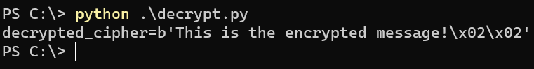

# AES-CTR-Reused_key-Known_plaintext_attack
This program is to decrypt  AES-CTR that reused key with a known plain text and cipher text pair 
Author: Kalana Sankalpa (Anon LK). 

## How to run 
Change the known_plaintext, known_ciphertext and the ciphertext that needs to decrypt. 
Change the padding value if necessary

